  

## `// ABOUT ME`

**Cybersecurity junior.**  
Building things.

**Focus:** Cybersecurity · AI · Software projects

---

## `// TECH STACK`

`Python` · `TypeScript` · `Next.js` · `FastAPI` · `Supabase` · `Git / GitHub` · `SQL`

## `// SECURITY TOOLING`

`Burp Suite` · `Nmap` · `Wireshark` · `ELK` · `Splunk` · `Kali Linux`

---

## `// FEATURED PROJECTS`

### FPL-AI
Fantasy Premier League prediction and optimization system.

`Python` · `FastAPI` · `AI`  
**Status:** Public / Active  
[View repository](https://github.com/GAWI01/FPL-AI)

### `[REDACTED]`
Private projects, experiments and things still being built.

**Status:** Building

---

## `// CURRENT OPERATIONS`

| | Status |
|---|---|
| Security | `ACTIVE` |
| AI systems | `BUILDING` |
| FPL-AI | `ACTIVE` |

> `> ship something useful █`

`build // break // learn // repeat`

---

  <a href="https://github.com/GAWI01">GITHUB</a>
  &nbsp;//&nbsp;
  <a href="https://github.com/GAWI01/FPL-AI">FPL-AI</a>
  &nbsp;//&nbsp;
  <a href="https://www.linkedin.com/in/gabriel-witz%C3%B8e-51384a275">LINKEDIN</a>

