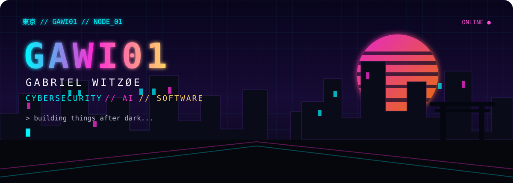
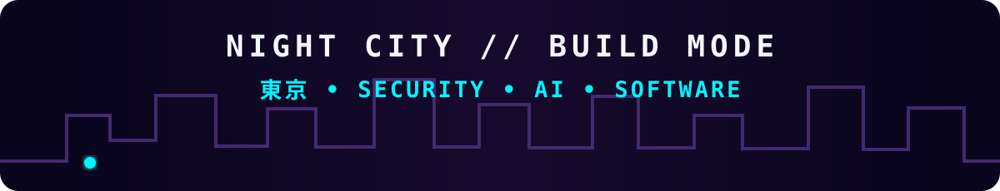

  

# About

**Cybersecurity junior · Building things.**

Cybersecurity · AI · Software

# Stack

`Python` `TypeScript` `Next.js` `FastAPI` `Supabase` `SQL` `Git`

**Security**  
`Burp Suite` `Nmap` `Wireshark` `ELK` `Splunk` `Kali Linux`

# Selected work

### [FPL-AI](https://github.com/GAWI01/FPL-AI)
Fantasy Premier League prediction and optimization system.  
`Python` `FastAPI` `AI` · **Public / Active**

### `[REDACTED]`
Private projects and experiments currently being built.  
**Status:** `BUILDING`

  

# Current

**Security** `ACTIVE` · **AI systems** `BUILDING` · **FPL-AI** `ACTIVE`

> `> ship something useful █`

  <code>build // break // learn // repeat</code>

  <a href="https://github.com/GAWI01"><b>GITHUB</b></a>
  &nbsp; // &nbsp;
  <a href="https://github.com/GAWI01/FPL-AI"><b>FPL-AI</b></a>
  &nbsp; // &nbsp;
  <a href="https://www.linkedin.com/in/gabriel-witz%C3%B8e-51384a275"><b>LINKEDIN</b></a>

