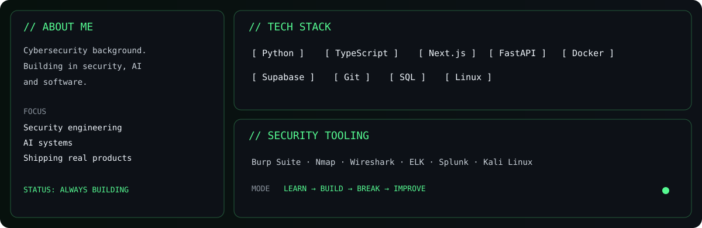
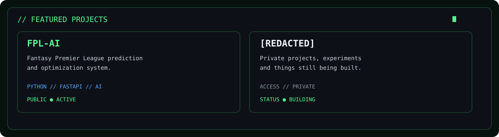
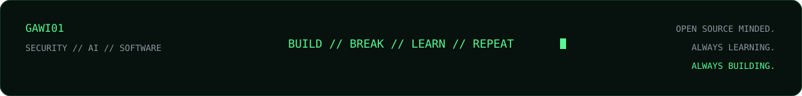

<p align="center">
  
</p>

<p align="center">
  <a href="https://github.com/GAWI01">GitHub</a> ·
  <a href="https://github.com/GAWI01/FPL-AI">FPL-AI</a> ·
  <a href="https://www.linkedin.com/in/gabriel-witz%C3%B8e-51384a275">LinkedIn</a>
</p>

<p align="center">
  
</p>

<p align="center">
  
</p>

## `> github --live`

<p align="center">
  
  
</p>

<p align="center">
  
</p>

## `> current_focus`

```text
[+] Security
[+] AI
[+] Software
[+] Building & shipping projects
[+] Learning continuously
```

## `> connect`

<p align="center">
  <a href="https://github.com/GAWI01"></a>
  <a href="https://www.linkedin.com/in/gabriel-witz%C3%B8e-51384a275"></a>
</p>

<p align="center">
  
</p>
