  

  <a href="https://github.com/GAWI01">GITHUB</a>
  &nbsp;//&nbsp;
  <a href="https://github.com/GAWI01/FPL-AI">FPL-AI</a>
  &nbsp;//&nbsp;
  <a href="https://www.linkedin.com/in/gabriel-witz%C3%B8e-51384a275">LINKEDIN</a>

<h2 align="center"><code>&gt; LIVE CONTRIBUTIONS</code></h2>

  

  PUBLIC GITHUB ACTIVITY // AUTO-UPDATING

