<p align="center">
  
</p>

<p align="center">
  <a href="https://github.com/GAWI01/FPL-AI">FPL-AI</a>
  &nbsp;·&nbsp;
  <a href="https://www.linkedin.com/in/gabriel-witz%C3%B8e-51384a275">LinkedIn</a>
</p>

---

## `> whoami`

```text
Gabriel Witzøe
Security // AI // Software
Norway
```

## `> projects`

### FPL-AI
Fantasy Premier League prediction and optimization system.

[View repository](https://github.com/GAWI01/FPL-AI)

```text
STATUS    ACTIVE
ACCESS    PUBLIC
CORE      PYTHON
```

### [REDACTED]

```text
STATUS    BUILDING
ACCESS    PRIVATE
DOCS      ...later
```

## `> github --stats`

<p align="center">
  
  
</p>

---

<p align="center">
  <code>build // break // learn // repeat</code>
</p>
